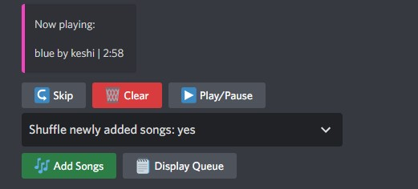
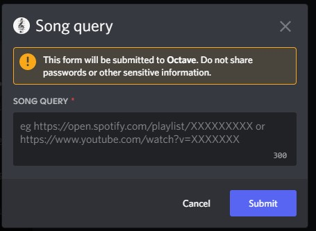

# octave_rust
Discord music bot written in Rust. 

Supports playing audio from YouTube video searches, YouTube video links, and Spotify playlists. 

This app is basically a backend that communicates with the Discord API, as such you need to register your own bot. The token for your bot must be available through the environment variable `OCTAVE_BOT_TOKEN`.

## System Requirements
`ffmpeg` and `youtube-dl`

## Basic Usage
Join a voice channel and type `o.ui` to show the user interface. Ensure that the bot has the required permissions to access both the voice channel and text channel in question. 

Enjoy! 

## Advanced Usage
There are several experimental features, which include song recommendation capabilities, audio volume normalization across playlists, and more, that are exposed via direct text commands only. There is no guarantee that these features are stable and the docs for these are a WIP- if you wish to try these out, looking through the source code might be your best option. 